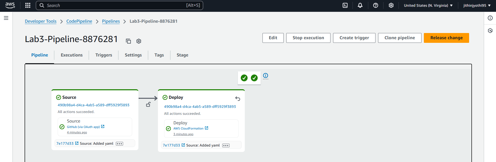
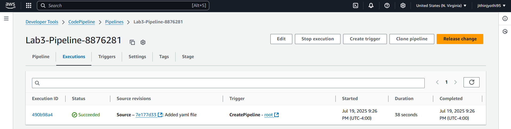
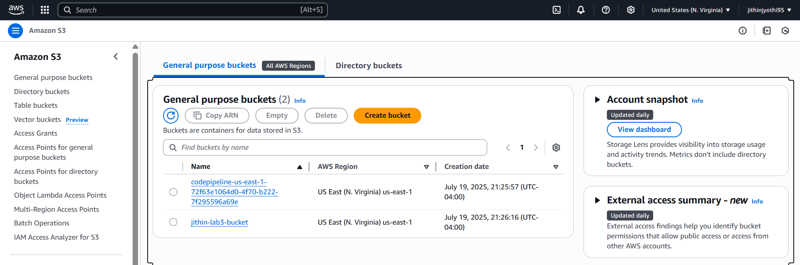
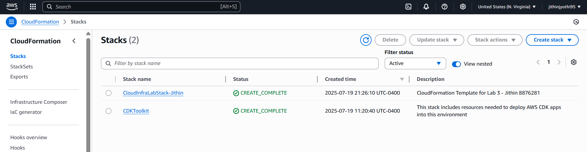
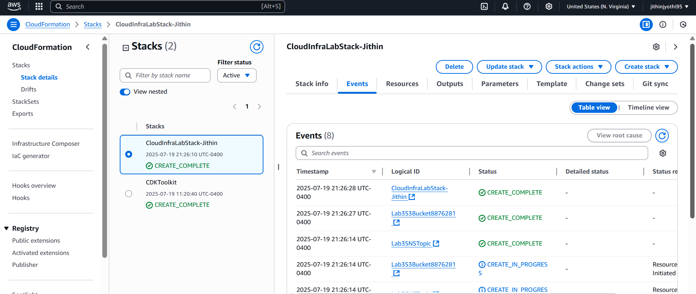
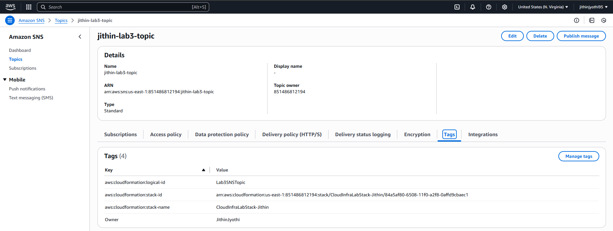
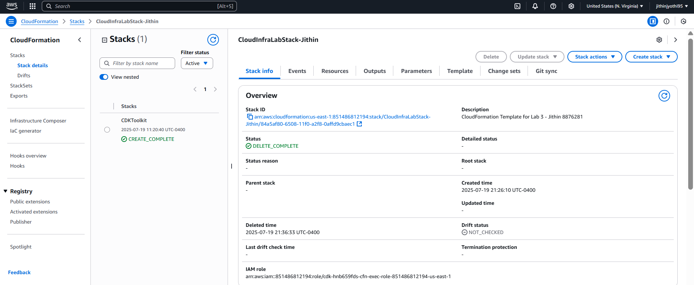

# Lab 3 – Automated Infrastructure Deployment using AWS CloudFormation and CodePipeline

**Name:** Jithin Jyothi  
**Student ID:** 8876281  
**GitHub Repo:** [Lab3-CloudFormation-8876281](https://github.com/JithinJyothi95/Lab3-CloudFormation-8876281)

---

## Objective

The goal of this lab was to automate the deployment of AWS infrastructure using **AWS CodePipeline** and **CloudFormation**. When I pushed my CloudFormation template to GitHub, the pipeline automatically created an **S3 bucket** and an **SNS topic**.

---

## Tech Stack Used

- **CloudFormation** to define the infrastructure
- **CodePipeline** for CI/CD
- **GitHub** for version control
- **S3 + SNS** as AWS resources
- **AWS Console** to verify everything

---

## Step-by-Step Implementation

### 1. Created GitHub Repository

I created a public GitHub repo named `Lab3-CloudFormation-8876281` and added a CloudFormation YAML file that defines an S3 bucket and an SNS topic.

---

### 2. Created the CodePipeline

Then I created a CodePipeline in the AWS Console that uses GitHub as a source and CloudFormation as the deploy provider.

**Pipeline ran successfully**:  

---

### 3. Verified Pipeline Execution Logs

I confirmed that the CodePipeline successfully pulled the repo and deployed the CloudFormation stack.

---

### 4. Verified S3 Bucket Creation

The bucket named `jithin-lab3-bucket` was successfully created.

---

### 5. Verified Stack in CloudFormation

The stack showed `CREATE_COMPLETE` status.

---

### 6. Verified Stack Events

CloudFormation showed the detailed resource creation events.

---

### 7. Verified SNS Topic Creation

An SNS topic named `jithin-lab3-topic` was created with CloudFormation tags.

---

### 8. Deleted the Stack to Avoid Charges

After everything worked as expected, I deleted the stack to clean up.

---

